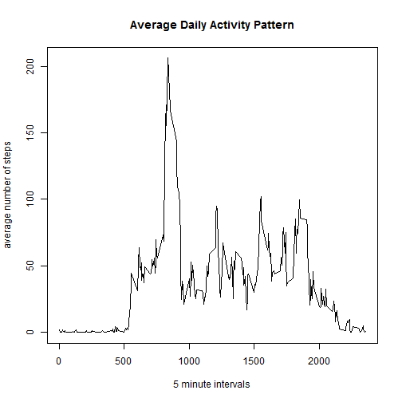
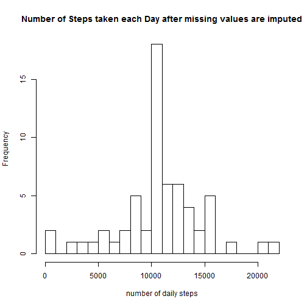

# Reproducible Research: Peer Assessment 1


## Loading and preprocessing the data

```r
data <- read.csv("activity.csv")
```

## What is mean total number of steps taken per day?

```r
nSteps <- aggregate(steps ~ date, data, sum)
hist(nSteps$steps, breaks = 20, main = "Histogram of the Number of Steps taken each Day", xlab = "number of daily steps")
```

 

Total number of steps taken per day... 

Mean 

```r
mean(nSteps$steps)
```

```
## [1] 10766
```
Median 

```r
median(nSteps$steps)
```

```
## [1] 10765
```
## What is the average daily activity pattern?

```r
avgByInterval <- aggregate(steps ~ interval, data, mean)
plot(avgByInterval$interval, avgByInterval$steps, type="n", main = "Average Daily Activity Pattern", xlab="5 minute intervals", ylab="average number of steps")
lines(avgByInterval$interval, avgByInterval$steps)
```

 
 
Which 5-minute interval, on average across all the days in the dataset, contains the maximum number of steps? 

```r
avgByInterval[which.max(avgByInterval$steps),1]
```

```
## [1] 835
```

## Imputing missing values
Total number of missing values in the dataset

```r
nrow(data) - nrow(na.omit(data))
```

```
## [1] 2304
```

Missing value imputing strategy: 
Replace missing values with mean number of steps across entire dataset. This will result in the means of the original and imputed datasets being equal. 

Create a new dataset that is equal to the original dataset but with the missing data filled in. 

```r
imputeddata <- data
naindex <- which(is.na(imputeddata)==TRUE) 
imputeddata[naindex,1] <- mean(data[,1], na.rm=TRUE)
```


```r
nSteps1 <- aggregate(steps ~ date, imputeddata, sum)
hist(nSteps1$steps, breaks = 20, main = "Number of Steps taken each Day after missing values are imputed", xlab = "number of daily steps")
```

 
 
Total number of steps taken per day... 

Mean 

```r
mean(nSteps1$steps)
```

```
## [1] 10766
```
Median 

```r
median(nSteps1$steps)
```

```
## [1] 10766
```

Do these values differ from the estimates from the first part of the assignment?  
The mean is the same. The median of the imputed data (10766) is 1 step higher than the median of the original data. 

What is the impact of imputing missing data on the estimates of the total daily number of steps?  
There is minimal impact.
## Are there differences in activity patterns between weekdays and weekends?
Create a new factor variable in the dataset with two levels - "weekday" and "weekend" indicating whether a given date is a weekday or weekend day. 

```r
weekend <- weekdays(as.Date(imputeddata$date)) %in% c("Saturday", "Sunday")
imputeddata$datetype[weekend == TRUE] <- "weekend"
imputeddata$datetype[weekend == FALSE] <- "weekday"
```
Make a panel plot containing a time series plot (i.e. type = "l") of the 5-minute interval (x-axis) and the average number of steps taken, averaged across all weekday days or weekend days (y-axis).  

```r
avgByIntervalWeekend <- aggregate(steps ~ interval, imputeddata[which(imputeddata$datetype=='weekend'),] , mean)
avgByIntervalWeekday <- aggregate(steps ~ interval, imputeddata[which(imputeddata$datetype=='weekday'),] , mean)

par(mfrow=c(2,1))
plot(avgByIntervalWeekend$interval,avgByIntervalWeekend$steps, type="n",  main="weekend", xlab="5 minute interval", ylab="steps")
lines(avgByIntervalWeekend$interval,avgByIntervalWeekend$steps)

plot(avgByIntervalWeekday$interval,avgByIntervalWeekday$steps, type="n", main="weekday", xlab="5 minute interval", ylab="steps")
lines(avgByIntervalWeekday$interval,avgByIntervalWeekday$steps)
```

 

